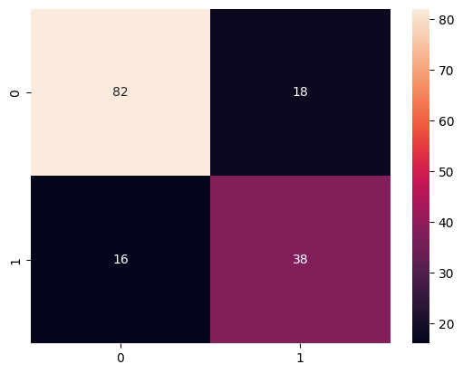

# 🩺 Diabetes Prediction using Machine Learning

A machine learning classification project that predicts whether a patient has diabetes based on medical diagnostic measurements.

The project includes data preprocessing, feature scaling, model training, hyperparameter tuning, cross-validation, and performance evaluation using multiple machine learning algorithms.

---

## 📌 Project Overview

This project aims to classify patients as diabetic or non-diabetic using the Pima Indians Diabetes Dataset.

The workflow includes:

- Data exploration and preprocessing
- Handling missing values
- Feature scaling using StandardScaler
- Train-Test Split
- K value optimization for K-Nearest Neighbors
- Training multiple machine learning models
- Model evaluation using various classification metrics
- Cross-validation for performance verification

---

## 📊 Dataset Features

| Feature | Description |
|----------|-------------|
| Pregnancies | Number of pregnancies |
| Glucose | Plasma glucose concentration |
| BloodPressure | Diastolic blood pressure (mm Hg) |
| SkinThickness | Triceps skin fold thickness |
| Insulin | 2-Hour serum insulin |
| BMI | Body Mass Index |
| DiabetesPedigreeFunction | Diabetes pedigree function |
| Age | Age of the patient |
| Outcome | Target variable (0 = Non-Diabetic, 1 = Diabetic) |

---

## 🤖 Machine Learning Model

- K-NN

---

## ⚙️ Data Preprocessing

- Data inspection
- Missing value handling
- Train-Test Split
- StandardScaler
- K value optimization for KNN

---

## 📈 Evaluation Metrics

The models were evaluated using:

- Accuracy Score
- Confusion Matrix
- Classification Report
- Jaccard Score
- Cross-Validation

---

## 📁 Project Structure

```
├── Diabetes_Prediction.ipynb
├── README.md
├── images/
│   ├── confusion_matrix.png
│   ├── heatmap.png
│   └── gris_search_k_value.png
└── requirements.txt
```

---

## 🛠 Technologies Used

- Python
- Pandas
- NumPy
- Matplotlib
- Seaborn
- Scikit-learn

---

## 🚀 How to Run

1. Clone this repository

```bash
git clone https://github.com/khusankamolov/phyton-lessons.git
```

2. Install dependencies

```bash
pip install -r requirements.txt
```

3. Open the Jupyter Notebook

```bash
jupyter notebook
```

4. Run all cells.

---

## 📷 Results

Model performance, confusion matrices, and evaluation metrics are available inside the notebook.

You can also include screenshots inside the **images/** folder and display them here.

Example:

```markdown



```

---

## 🎯 Future Improvements

- Hyperparameter tuning using GridSearchCV
- Feature selection
- Model deployment with Flask or Streamlit
- Explainability using SHAP values

---

## 👨‍💻 Author

**Husan Kamolov**

Machine Learning Enthusiast
