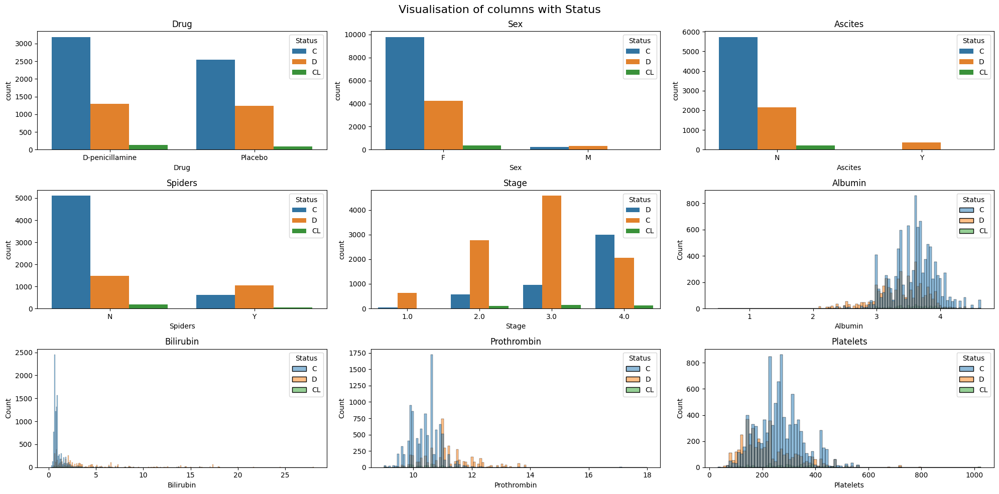

# 🩺 Liver Cirrhosis Survival Prediction

A machine learning project developed for a Kaggle competition to predict the survival status of patients with liver cirrhosis using clinical and demographic features.

The project covers the complete machine learning pipeline, including data preprocessing, exploratory data analysis (EDA), feature engineering, model training, hyperparameter tuning, model evaluation, and Kaggle submission generation.

---

## 📌 Problem Statement

The objective is to predict the survival status of liver cirrhosis patients based on their medical records. This is a multiclass classification problem where the target variable represents different patient outcomes.

---

## 🚀 Project Highlights

- Comprehensive Exploratory Data Analysis (EDA)
- Missing value handling
- Feature engineering
- Data preprocessing pipeline
- Model comparison
- Hyperparameter tuning
- Cross-validation
- Performance evaluation using Log Loss
- Final prediction generation for Kaggle competition submission

---

## 🤖 Models Evaluated

- Decision Tree
- Random Forest
- K-Nearest Neighbors (KNN)
- Support Vector Machine (SVM)
- **XGBoost (Best Performing Model ✅)**

XGBoost achieved the best overall performance and was used to generate the final competition submission.

---

## 📊 Exploratory Data Analysis

### Count Plots



---

## 📂 Repository Structure

```text
Liver-Cirrhosis-Survival-Prediction/
│
├── images/
│   └── countplots.png
│
├── README.md
├── requirements.txt
├── train.csv
├── test.csv
├── sample_submission.csv
├── submission.csv
└── liver_cirrhosis_survival_prediction.ipynb
```

---

## 🛠 Tech Stack

- Python
- Pandas
- NumPy
- Matplotlib
- Seaborn
- Scikit-learn
- XGBoost
- Jupyter Notebook

---

## ▶️ Running

Open the notebook and execute all cells:

```bash
jupyter notebook
```

---

## 📈 Evaluation

Models were evaluated using:

- Log Loss (Competition Metric)
- Accuracy
- Classification Report

The final Kaggle submission was generated using the predictions from the XGBoost model.

---

## 🏆 Competition

This project was created as part of a Kaggle Machine Learning Competition. The final submission file (`submission.csv`) contains predictions generated by the best-performing XGBoost model.

---

## Author

**Husanjon Kamolov**