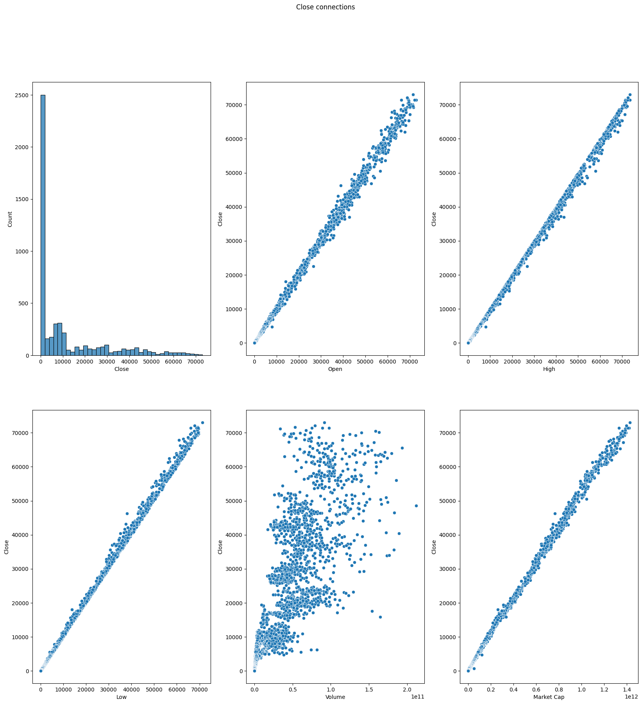

# Bitcoin Price Prediction

A machine learning project focused on predicting Bitcoin's next-day closing price using historical market data and time-series feature engineering.



## Overview

This project uses historical Bitcoin market data from July 2010 to May 2024 to investigate how previous market information can be used to predict the following day's closing price.

The main goal was to compare different regression models and understand how they perform on a chronological time-series dataset.

## Dataset

The dataset contains historical Bitcoin market information, including:

- Date
- Open
- High
- Low
- Close
- Volume
- Market Cap

The target variable is the **next day's closing price**.

## Feature Engineering

Several features were created from the original data to provide the models with information about previous observations:

- `month`
- `year`
- `day`
- `week_day`
- `Close_lag1`
- `Close_lag7`
- `return_1d`

Lag features were used to incorporate previous Bitcoin prices into the prediction task.

Rows with missing values created during feature engineering were removed.

## Data Preprocessing

The dataset was first ordered chronologically to preserve the time-series structure.

The data was then divided into:

- **80% training data**
- **20% testing data**

Feature scaling was performed using `StandardScaler`.

The scaler was fitted on the training data and then applied to the test data to avoid data leakage.

## Models

Three regression approaches were compared:

### Linear Regression

Used as a baseline model to measure how well the engineered features can predict the target through a linear relationship.

### Random Forest

A tree-based ensemble model capable of capturing nonlinear relationships between the input features and the target variable.

Hyperparameter tuning was performed using `GridSearchCV`.

### XGBoost

A gradient boosting model was used to further compare nonlinear tree-based methods with the baseline Linear Regression model.

## Evaluation

The models were evaluated using:

- **MAE — Mean Absolute Error**
- **RMSE — Root Mean Squared Error**

MAE represents the average absolute difference between the predicted and actual prices, while RMSE gives greater weight to larger prediction errors.

## Results

The models showed noticeably different performance on the test set.

In this experiment, Linear Regression produced the lowest MAE among the tested models, while Random Forest and XGBoost produced higher prediction errors.

The results show that a relatively simple model can perform strongly when the features contain information that is closely related to the target variable.

## Visualization

The project includes visualizations of relationships between Bitcoin's closing price and other market variables, including:

- Open price
- High price
- Low price
- Volume
- Market capitalization

These plots provide an overview of the dataset and its main relationships before model training.

## Technologies

- Python
- Pandas
- NumPy
- Matplotlib
- Seaborn
- Scikit-learn
- XGBoost

## Project Structure

```text
Time Series Models/
│
├── bitcoin_2010-07-17_2024-05-23.csv
├── Time_series_models_bitcoins.ipynb
├── Time_series_subplots.png
└── README.md